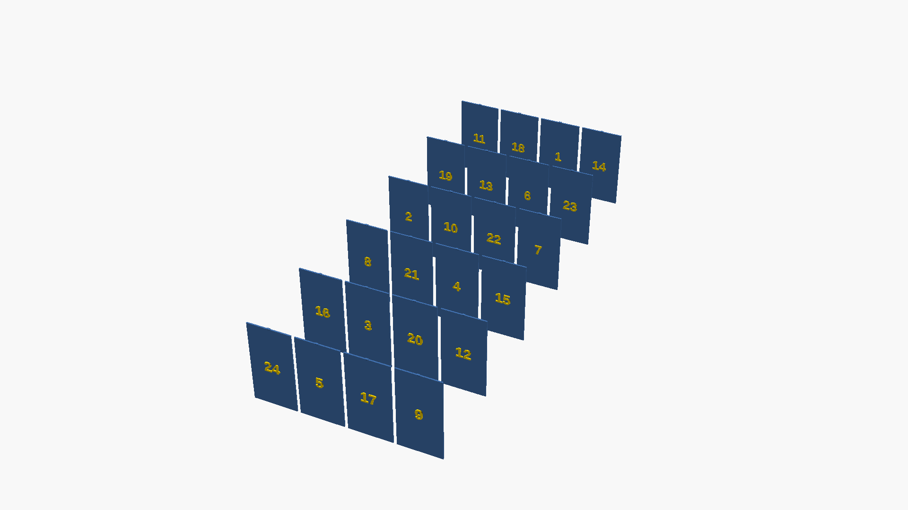

# 3D Modeling with AI - Hackathon 2025

**Learning prompt engineering through programmatic 3D modeling**

[](https://budavariam.github.io/hackathon-3dmodels/#/)
[](./prompts/claude.md)

## Overview

This repository documents a hands-on learning journey exploring **prompt engineering** by creating **3D models programmatically** using OpenSCAD and Claude Code. The goal is to understand how to effectively communicate with AI assistants through iterative prompt refinement.

**Final Project:** A fully functional 3D-printable **Advent Calendar** with 24 snap-fit doors featuring randomized numbers.

## 🎯 Goals

- **Master prompt engineering** through practical application
- Use **Claude Code** as the primary development tool
- Create **OpenSCAD models** through conversational AI
- Learn by **iterating and refining** prompts
- Build **reusable component libraries**
- Complete a **real-world project** from concept to printable STL files

## 📚 Learning Journey

The entire learning process is documented in [**prompts/claude.md**](./prompts/claude.md), showing:

- **Original prompts** - What was asked
- **Improvement suggestions** - How to make prompts more effective
- **Iterative refinement** - Evolution from vague requests to precise specifications

### Key Milestones

1. **Project Setup** - Created CLAUDE.md documentation for future AI instances
2. **Reusable Shapes** - Built icon library (WiFi, temperature) with parametric functions
3. **Component Library** - Developed common 3D printing components (boxes, hinges, standoffs)
4. **Preview Generation** - Automated multi-angle PNG exports (perspective, wireframe, blueprint)
5. **Advent Calendar** - Complex project with snap-fit mechanisms and randomized layouts
6. **Build Automation** - Fixed OpenSCAD export scripts and GitHub Actions deployment

### Prompt Engineering Insights

**Before:** Vague requests like "make it look like an advent calendar"

**After:** Precise specifications like:
> "Simplify to a uniform 6×4 grid where all doors are the same rectangular size. Keep snap-fit hinges and embossed numbers, but only randomize the number assignments (1-24) across grid positions using the seed parameter for repeatability."

**Key Lessons:**
- ✅ Specify exact measurements and technical details
- ✅ Break complex tasks into clear, sequential steps
- ✅ Use precise terminology (embossed vs beveled, recessed vs raised)
- ✅ Reference coordinate systems explicitly (X, Y, Z axes)
- ✅ Include expected file outputs and verification steps

## 🚀 Quick Start

### Prerequisites

```bash
# macOS
brew install openscad

# Linux
apt-get install openscad
```

### Generate STL Files

```bash
# Navigate to a project
cd projects/advent_calendar

# Export STL files
bash export_stl.sh

# Generate preview images
bash ../../scripts/generate_previews.sh case.scad
```

### Optimize PNG Files

```bash
# Install dependencies
make install-deps

# Compress all PNG files (50-70% size reduction)
make optimize-pngs
```

## 📁 Repository Structure

```
.
├── README.md                    # This file
├── LICENSE                      # MIT License
├── CLAUDE.md                    # AI assistant instructions
├── Makefile                     # Common automation tasks
├── .github/
│   └── workflows/
│       └── deploy-presentation.yml  # Auto-deploy slides to GitHub Pages
├── docs/
│   └── CHEATSHEET.md           # OpenSCAD syntax reference
├── scripts/
│   ├── generate_previews.sh    # Multi-angle PNG generation
│   └── optimize_pngs.sh        # PNG compression tool
├── lib/                         # Reusable component libraries
│   ├── boxes_and_plates.scad   # Parametric boxes, mounting plates
│   ├── mechanical_and_utility.scad  # Joints, cables, ventilation
│   ├── icon_library.scad       # Decorative icons (WiFi, temp, etc.)
│   └── README.md               # Library documentation
├── projects/                    # Production-ready projects
│   └── advent_calendar/        # 24-door advent calendar
│       ├── case.scad           # Main model
│       ├── export_stl.sh       # STL export script
│       ├── notes.md            # Design specs & printing guide
│       ├── output/             # Generated STL files
│       └── previews/           # Generated preview images
├── playground/                  # Experimental work
│   ├── 002_reusable_shapes/    # Icon demonstrations
│   └── 003_common_components/  # Component library examples
├── presentation/                # Hackathon presentation
│   ├── presentation.md         # RevealJS slides (Markdown)
│   ├── images/                 # Presentation images
│   └── README.md               # Local dev & deployment guide
└── prompts/
    └── claude.md               # Learning journey & prompt audit
```

## 🎨 Featured Project: Advent Calendar

**24-door calendar with snap-fit hinges and randomized numbers**

<div style="display: grid; grid-template-columns: repeat(3, 1fr); gap: 20px; margin: 20px 0;">
<div>

**Complete Calendar**


</div>
<div>

**Box Only**


</div>
<div>

**All Doors (Print Layout)**


</div>
</div>

### Features

- **Dimensions:** 410×510×60mm (vertical orientation)
- **Grid:** 6 columns × 4 rows (uniform doors ~65×122mm each)
- **Snap-fit hinges:** 3mm diameter pins with 0.2mm clearance
- **Randomized numbers:** 1-24 using seed-based shuffle (repeatable)
- **Embossed numbers:** 1.5mm raised with gold color contrast
- **Print time:** ~16-20 hours total (box + 24 doors)

### Quick Start

```bash
cd projects/advent_calendar

# Generate STL files (~1-2 minutes)
bash export_stl.sh

# Generate preview images
bash ../../scripts/generate_previews.sh case.scad
```

**Generated files:**
- `output/advent_box.stl` - Main calendar box (535KB)
- `output/all_doors.stl` - All 24 doors for batch printing (1.7MB)
- `output/door_*.stl` - Sample individual doors

See [projects/advent_calendar/notes.md](./projects/advent_calendar/notes.md) for detailed printing recommendations and assembly instructions.

## 🛠 Technologies

- **OpenSCAD** - Script-based CAD for programmatic 3D modeling
- **Claude Code** - AI pair programmer from Anthropic
- **RevealJS** - HTML presentation framework
- **GitHub Actions** - Automated deployment to GitHub Pages
- **Bash/Makefile** - Build automation and scripting

## 📊 Component Library

Reusable modules in `lib/`:

**Boxes & Mounting:**
- `parametric_box()` - Customizable boxes with wall thickness
- `mounting_plate()` - Plates with screw holes
- `screw_post()` - Threaded mounting posts
- `pcb_standoff()` - PCB mounting standoffs

**Mechanical Joints:**
- `snapfit_male()` / `snapfit_female()` - Snap-fit mechanisms
- `living_hinge()` - Flexible hinges

**Cable Management:**
- `cable_clip()` - Cable routing clips
- `cable_guide()` - Cable channel guides
- `ventilation_grid()` - Airflow grids

**Decorative:**
- `wifi_icon()` - WiFi signal indicator
- `temperature_icon()` - Temperature sensor marker

See [lib/README.md](./lib/README.md) for full documentation.

## 📖 Documentation

- **[CLAUDE.md](./CLAUDE.md)** - Instructions for AI assistants operating in this repo
- **[docs/CHEATSHEET.md](./docs/CHEATSHEET.md)** - OpenSCAD syntax quick reference
- **[lib/README.md](./lib/README.md)** - Component library API documentation
- **[prompts/claude.md](./prompts/claude.md)** - Prompt engineering learning log
- **[presentation/README.md](./presentation/README.md)** - Presentation build & deployment

## 🎓 View the Presentation

The full hackathon review presentation is available online:

**[🔗 View Slides](https://budavariam.github.io/hackathon-3dmodels/#/)**

**[📄 Download PDF](https://budavariam.github.io/hackathon-3dmodels/?print-pdf-now)** - Export slides as PDF (use browser's Print to PDF)

### Topics Covered

1. **The Goal** - Learning prompt engineering through 3D modeling
2. **The Journey** - From first prompt to complex models
3. **Technical Deep Dive** - OpenSCAD, parametric design, automation
4. **Advent Calendar Project** - Design process and challenges
5. **Key Learnings** - Prompt engineering best practices
6. **Results & Demos** - STL files, preview images, live examples

### Run Locally

```bash
cd presentation
npx revealjs-cli --open ./presentation.md
```

## 🤖 AI Collaboration

This project showcases effective AI collaboration patterns:

**✅ What Worked Well:**
- Iterative refinement with immediate feedback
- Precise technical specifications in prompts
- Breaking complex tasks into smaller steps
- Documenting prompts for continuous learning
- Using AI for code generation AND documentation

**❌ What Didn't Work:**
- Vague requests without context
- Assuming AI knows your coordinate system preferences
- Skipping verification steps after code generation
- Not specifying expected outputs

See [prompts/claude.md](./prompts/claude.md) for detailed examples.

## 🔧 Development Commands

```bash
# Generate STL files for all projects
make render-all

# Generate preview images for all projects
make test-previews

# Optimize all PNG files
make optimize-pngs

# Clean generated files
make clean

# Install required dependencies
make install-deps

# View all available commands
make help
```

## 📝 License

MIT License - See [LICENSE](./LICENSE) for details

## 🙏 Acknowledgments

- **[Anthropic](https://www.anthropic.com/)** - Claude Code AI assistant
- **[OpenSCAD](https://openscad.org/)** - Script-based 3D CAD
- **[RevealJS](https://revealjs.com/)** - Presentation framework

---

**Built with ❤️ and AI pair programming**

[View Presentation](https://budavariam.github.io/hackathon-3dmodels/#/) | [Download PDF](https://budavariam.github.io/hackathon-3dmodels/?print-pdf-now) | [View Prompts](./prompts/claude.md) | [Report Issues](https://github.com/budavariam/hackathon-3dmodels/issues)
