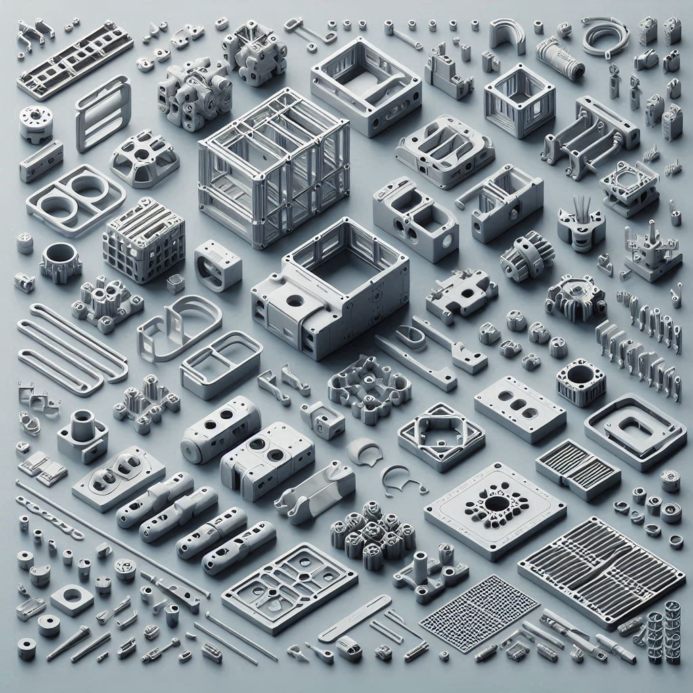
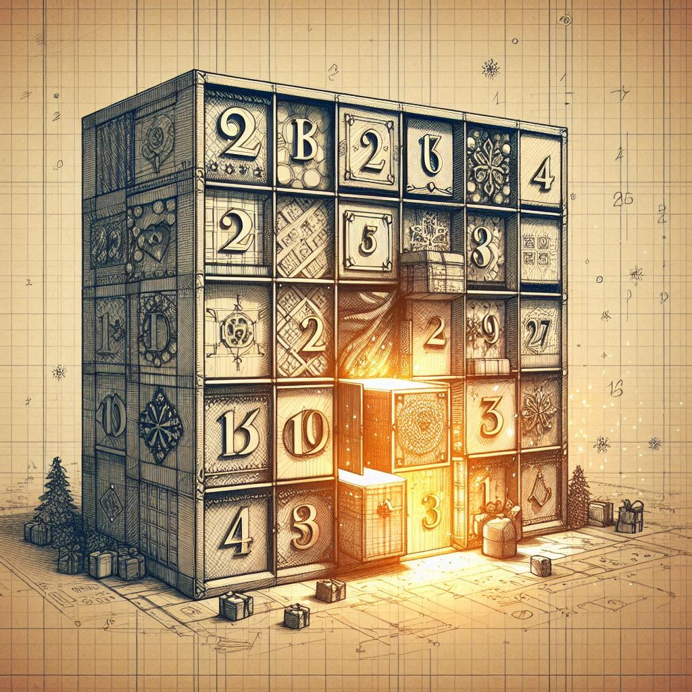
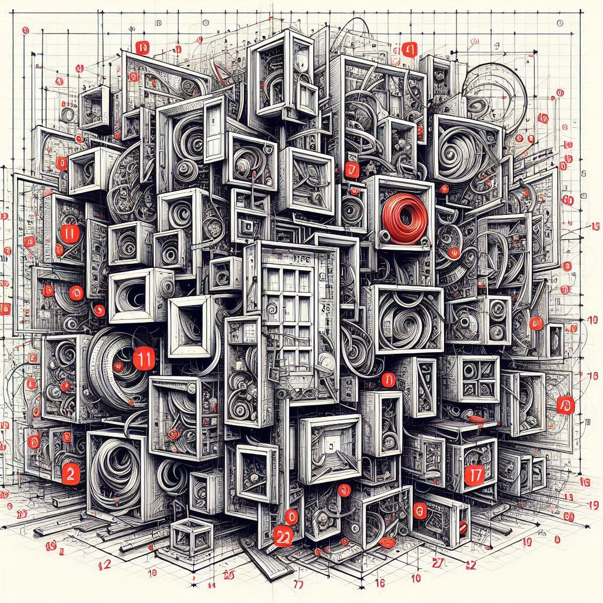
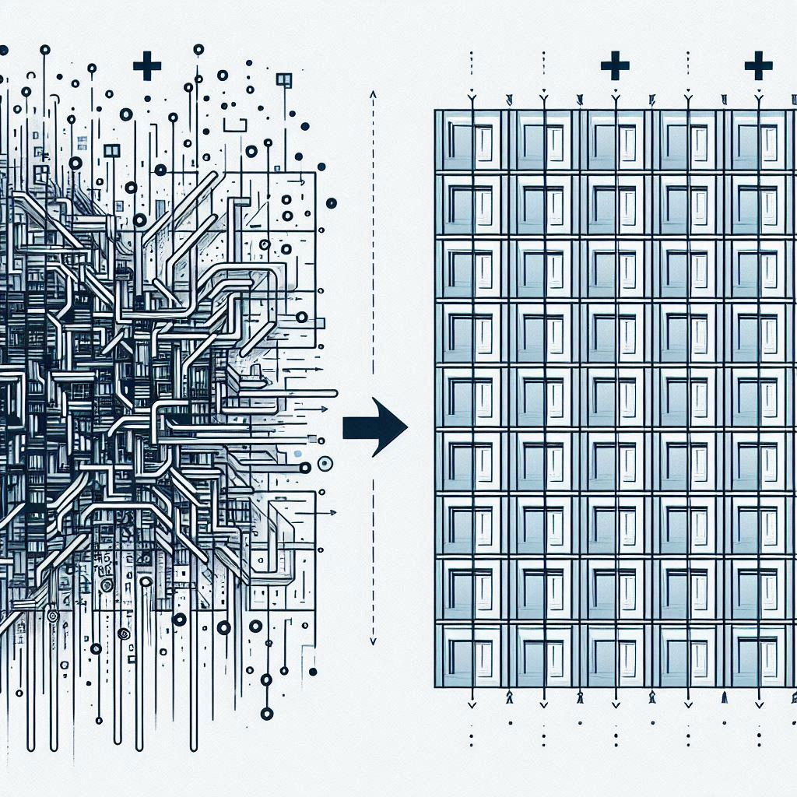
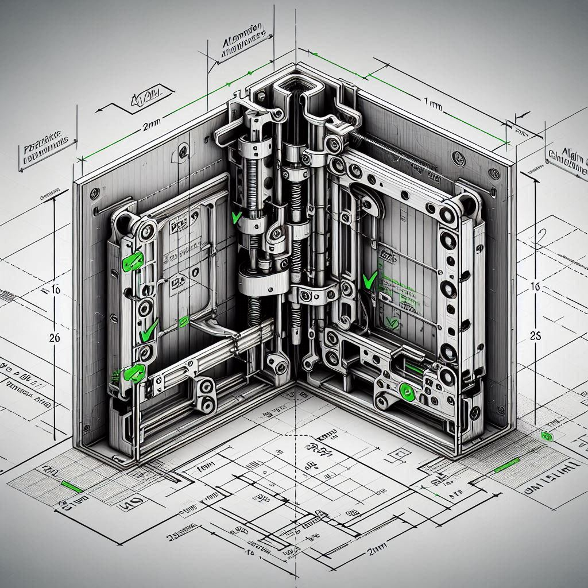
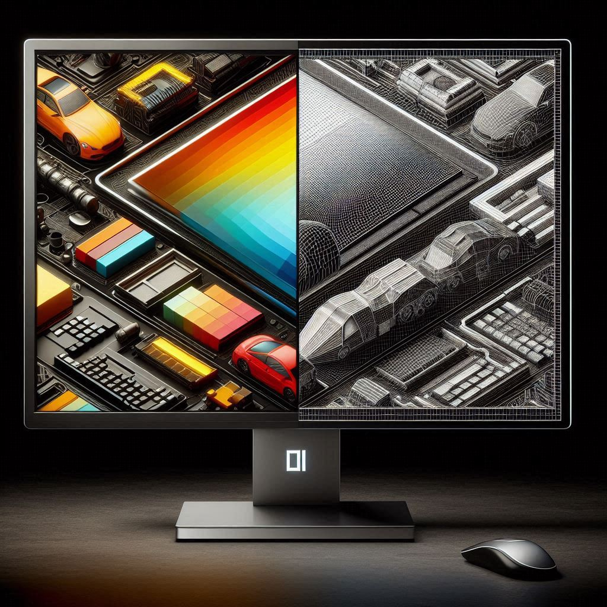
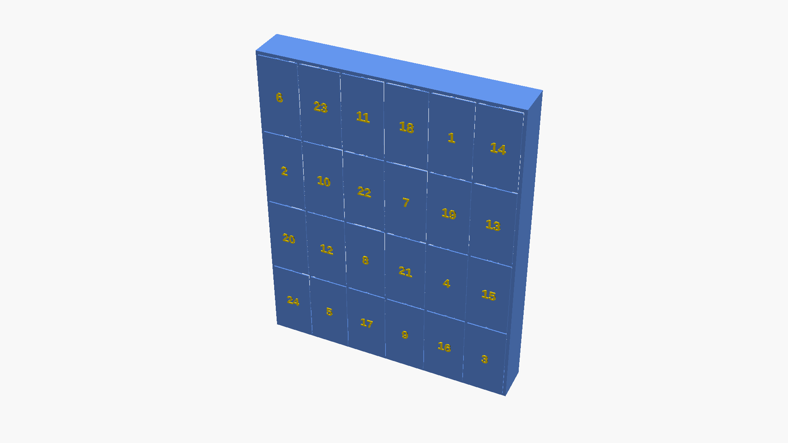
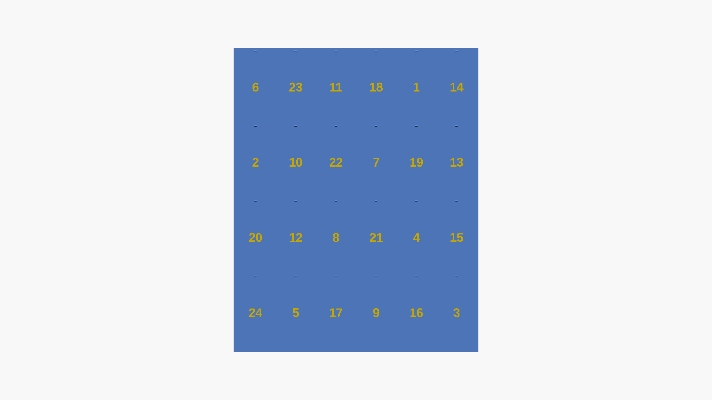
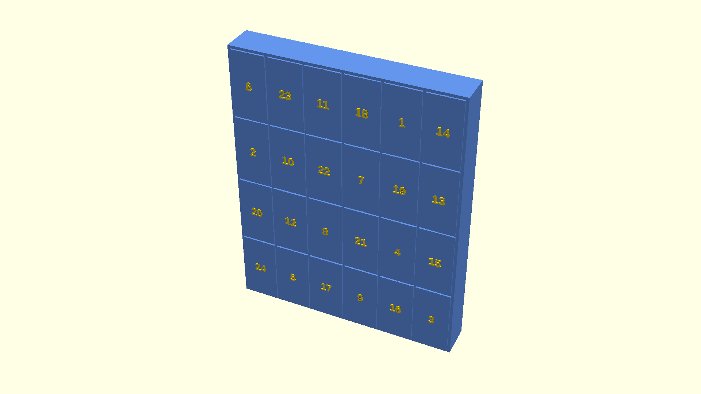
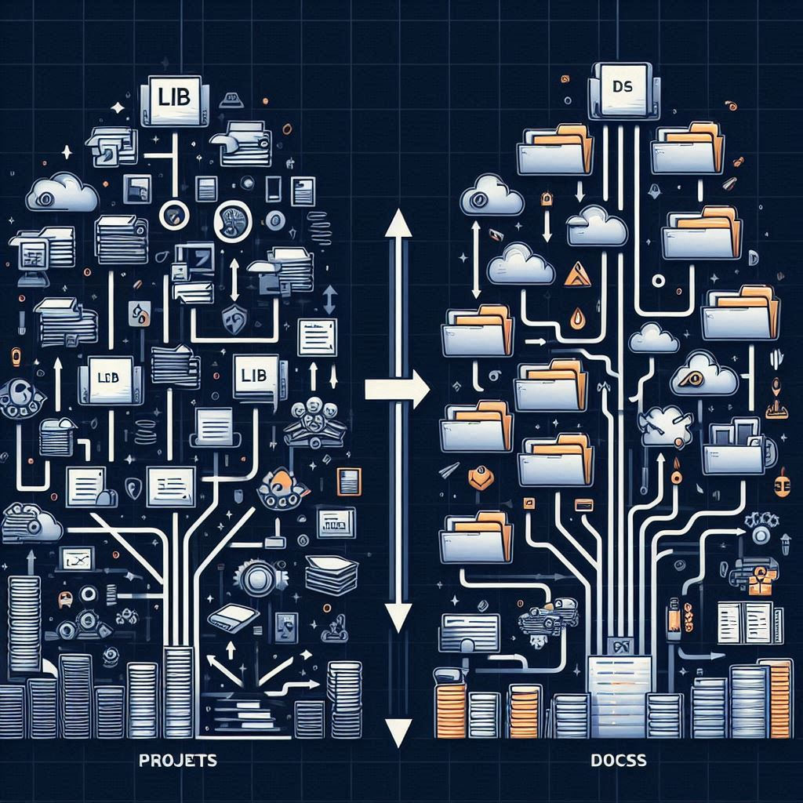

<!-- markdownlint-disable MD033 MD025 MD042 MD031 -->

<link rel="stylesheet" href="./asciinema-player.css">
<link rel="icon" type="image/x-icon" href="./images/favicon.ico">
<script src="./asciinema-player.min.js"></script>
<script src="./presentation.js"></script>

# 3D Modeling with AI

## Hackathon Review 2025

 {.stretch}

---

## The Goal

Learning prompt engineering through **programmatic 3D modeling**

- Use **Claude Code** as the primary tool
- Create **OpenSCAD models** through conversation
- Learn by **iterating and refining** prompts
- Build **reusable component libraries**
- Complete a **real-world project**: Advent Calendar

 {.stretch}

---

## The Journey Begins

**First steps**: Understanding the codebase

- Analyzed repository structure
- Created `CLAUDE.md` documentation
- Established development workflows
- Set up automation scripts

 {.stretch}

<aside class="notes">

Started by having Claude analyze the codebase and create comprehensive documentation. This established clear patterns for future work.

</aside>

---

## Building Reusable Components

**Playground 002**: Icon Library

- WiFi symbol (cut-out & embossed)
- Temperature indicator
- Parametric, reusable modules
- Learned about OpenSCAD's `use <file.scad>` pattern

 {.stretch}

**Key learning**: Modularization and code organization

---

## Expanding the Toolkit

**Playground 003**: Common Component Library

Created comprehensive 3D printing components:

- **Boxes & Mounting**: Parametric boxes, mounting plates, PCB standoffs
- **Mechanical**: Snap-fit joints, living hinges
- **Utility**: Cable clips, ventilation grids, wall mounts

 {.stretch}

**Key learning**: Designing for real-world 3D printing constraints

---

## Automation & Workflows

**Scripts & Tools**:

- `generate_previews.sh` - 6 standard views (perspective, top, front, left, wireframe, blueprint)
- `optimize_pngs.sh` - Compress images for git (50-70% reduction)
- Makefile for common tasks
- Export scripts for STL generation

 {.stretch}

**Key learning**: Automation accelerates iteration

---

## The Main Project

**Advent Calendar with Snap-Fit Doors**

Requirements:
- 24 doors numbered 1-24
- Uniform rectangular grid
- Snap-fit hinges (no metal parts)
- Embossed numbers in contrasting color
- Randomized number positions

 {.stretch}

---

## Iteration 1: Initial Design

Started with complexity:
- Random door sizes (small, medium, large)
- Variable grid layout
- Beveled numbers

 {.stretch}

**Lesson**: Simpler is often better

---

## Iteration 2: Fixing Orientation

**Challenge**: Box was horizontal, numbers not visible

**Solution**:
- Changed box to vertical (400×510mm)
- Made numbers embossed instead of recessed
- Updated coordinate system (Z = vertical)

 {.stretch}

**Key learning**: Clear specifications prevent misunderstandings

---

## Iteration 3: Simplification

**User feedback**: "It looks ugly"

**Changes**:
- Uniform 6×4 grid
- All doors same size
- Only randomize numbers (not sizes)
- Added visible 2mm padding

 {.stretch}

**Key learning**: User feedback drives design decisions

---

## Iteration 4: Alignment & Clearances

**Challenges**:
- Doors not aligned with openings
- Missing door cutouts in box
- Hinge holes not properly positioned

**Solutions**:
- Box dimensions: 410×510mm (accounts for padding)
- Door positioning: `translate([x, -(door_thickness + 1), z])`
- Proper hinge slot placement

 {.stretch}

**Key learning**: Coordinate systems matter!

---

## Iteration 5: Number Orientation

**Challenge**: Numbers oriented horizontally (Y-axis) instead of vertically

**Evolution**:
```openscad
// Wrong: Numbers horizontal
linear_extrude(height=number_depth)
    flat_number(day);

// Correct: Numbers vertical (Z-axis aligned)
rotate([90, 0, 0])
    linear_extrude(height=number_depth)
        flat_number(day);
```

 {.stretch}

**Key learning**: Rotations transform coordinate planes

---

## Wireframe Previews

**Request**: "Like pressing F11 in OpenSCAD"

**Solution**: Updated preview script

```bash
# Before: Edges with surfaces
--view=axes,scales,edges

# After: True wireframe (Thrown Together mode)
--preview=throwntogether
```

 {.stretch}

**Key learning**: Knowing the right tool flags

---

## What I Learned

**Prompt Engineering**:
- Be specific about dimensions, coordinates, and transformations
- Provide technical details upfront
- Use visual feedback to refine requirements

**3D Modeling**:
- Coordinate systems (X, Y, Z) and rotations
- Clearances and tolerances for 3D printing
- Snap-fit mechanisms and hinge design

**Development Workflow**:
- Iterate quickly with preview images
- Automate repetitive tasks
- Document as you go

 {.stretch}

---

## Prompt Quality Evolution

**Initial prompts**: Vague and ambiguous
> "please add a new folder in src..."

**Improved prompts**: Specific and measurable
> "Create an advent calendar project in projects/advent_calendar/ with: 1) A rectangular box (410x510mm) with 24 door openings, 2) Doors in uniform 6x4 grid..."

**Result**: Faster iterations, fewer misunderstandings

 {.stretch}

**Key insight**: Better prompts = Better results

---

## The Final Result

**Advent Calendar Features**:
- ✅ 410mm × 510mm vertical box
- ✅ 24 uniform doors in 6×4 grid
- ✅ Snap-fit hinges (3mm diameter, 0.2mm clearance)
- ✅ Gold embossed numbers (vertically oriented)
- ✅ 2mm visible padding between doors
- ✅ Randomized number positions (seed-based)

 {.stretch}

---

## Final Result: Multiple Views

<style> .grid-container { display: grid; grid-template-columns: 1fr 1fr; gap: 1.5rem; height: 60vh; align-items: center; justify-items: center; } .grid-item { display: flex; flex-direction: column; align-items: center; justify-content: center; width: 100%; height: 100%; } .grid-item h4 { margin: 0 0 1rem 0; font-size: 1.3em; } .grid-item img { max-height: 25vh; max-width: 90%; object-fit: contain; } </style> <div class="grid-container"> <div class="grid-item"> <h4>Front View</h4>  </div> <div class="grid-item"> <h4>Top View</h4>  </div> <div class="grid-item"> <h4>Wireframe</h4>  </div> <div class="grid-item"> <h4>Left View</h4>  </div> </div>

---

## Repository Structure

**Before**: Flat, unorganized
```
src/
  001_box_with_lid/
  002_reusable_shapes/
```

**After**: Professional organization
```
lib/                    # Reusable components
projects/               # Build projects
playground/             # Experiments
scripts/                # Automation
docs/                   # Documentation
prompts/                # Prompt audit log
```

 {.stretch}

---

## Key Takeaways

**Technical Skills**:
- OpenSCAD programmatic modeling
- 3D printing design constraints
- Git repository organization
- Bash scripting and automation

**Soft Skills**:
- Iterative refinement through feedback
- Clear communication with AI
- Documentation best practices
- Prompt engineering techniques

**Mindset**:
- Start simple, add complexity as needed
- Iterate quickly with visual feedback
- Document learning for future reference

 {.stretch}

---

## Thank You!

**Resources**:
- Repository: `hackathon-3dmodels/`
- Prompt Audit: `prompts/claude.md`
- Documentation: `CLAUDE.md`
- Components: `lib/`
- Final Project: `projects/advent_calendar/`

 {.stretch}

**Question**: What will you create with prompt engineering?
