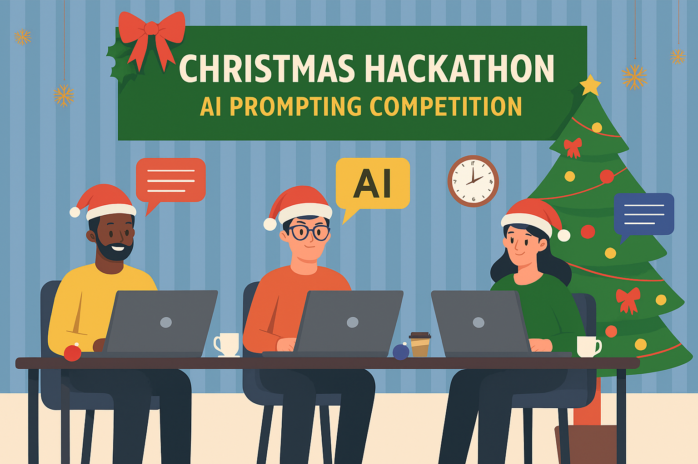

<!-- markdownlint-disable MD033 MD025 MD042 MD031 -->

<link rel="stylesheet" href="./asciinema-player.css">
<link rel="icon" type="image/x-icon" href="./images/favicon.ico">

# AI Hackathon 2025

 {.stretch}

---

## Motivation

- Unix/Linux is a stable, secure, multiuser, easily programmable multitask system that has extensive network support
- In the **cloud** it is almost inevitable to meet with a Unix-like system
- Many companies use Linux to **serve their web applications**
- Many Linux distributions are **open source and free**, many developers use it as their work environment
- It has many variations everyone can find one that **suits their needs** or **customize** it to do so
- It's great to **automate** common tasks
- Easy to write **reproducible** scenarios
- It's good to know the tools we have

note: class: 1

<aside class="notes">

Discuss

- what Linux will you use
- what do you want to achieve with this course
- how familiar you are with Linux

</aside>

---

# Terminology and Philosophy {.chapter}

<table class="chapter-table">
  <tr>
    <td class="align-left">
      <ul>
        <li>Glossary</li>
        <li>UNIX vs LINUX</li>
        <li>GNU/Linux</li>
        <li>UNIX Philosophy</li>
        <li>UNIX Variations</li>
        <li>Distros</li>
      </ul>
    </td>
    <td class="align-right">
      
    </td>
  </tr>
</table>

---

## Glossary

- **Operating System (OS)**: Manages computer hardware, software resources, and provides common services for computer programs
- **Hardware**: Physical machine components, including CPU, memory, storage, and input/output devices
- **Kernel**: The core of the OS that communicates between hardware and applications
- **Shell**: A program that provides an interface to interact with the OS, either via command-line (CLI) or scripts
- **Terminal Emulator/Window**: A wrapper program that runs a shell, allowing users to enter commands
- **Applications/Software**: General-purpose programs that help users achieve high-level goals

 {.stretch}

---

## Getting started

 {.stretch}

- On start, you'll see a `prompt` (a series of symbols on the screen indicating that you can input a command)
- The prompt is usually a wide cursor preceeded by information about the current state of the machine, like:
  - current folder
  - username
  - machine name
  - or any other custom information
- the shell prompt waits for instructions, then interprets commands line by line, and calls the program that corresponds to it.
- Beware! There is NO magical `undo` command, and no `Recycle bin`.
- Not all Linux installs come with a GUI, in that case you run the shell directly in TTY session

---
